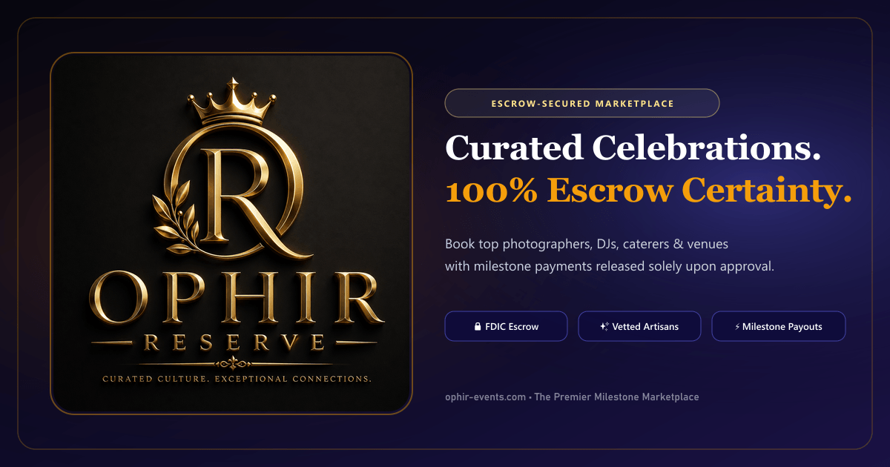

# Ophir Reserve — Modern Milestone & Escrow Marketplace

<div align="center">
  

  <p align="center">
    <strong>The premier escrow-secured marketplace for milestone events, verified artisans, bespoke services, and family collaborative planning.</strong>
  </p>

  <p align="center">
    <a href="#key-features">Key Features</a> •
    <a href="#tech-stack">Tech Stack</a> •
    <a href="#getting-started">Getting Started</a> •
    <a href="#project-structure">Project Structure</a> •
    <a href="#seo--open-graph">SEO & Metadata</a>
  </p>
</div>

---

## 🌟 Key Features

### 1. 🔒 100% Escrow Milestone Protection
- **Ophir Escrow Vault**: Client payments are locked securely into an FDIC-insured escrow depository account.
- **Sign-Off Certainty**: Funds are released to vendors solely upon client milestone approval, providing trust for clients and guaranteed payment for artisans.

### 2. ✨ Curated Artisans & Vendor Directory
- **Verified Credentials**: Background checks, insurance, past performance audits, and high-definition portfolio reviews.
- **Dynamic Occasions Filter**: Weddings, Quinceañeras, Bar/Bat Mitzvahs, Anniversaries, Corporate Galas, and Birthdays.
- **Interactive Package Builder**: Tiered package selections (Silver, Gold, Platinum) with real-time add-ons and quotes.

### 3. 👨‍👩‍👧‍👦 Family Collaborative Hub
- **Group Milestone Planning**: Shared event dashboards for family members and planning committees.
- **Shortlisting & Voting**: Add candidate vendors to a shared shortlist and vote on proposals collaboratively.

### 4. 💼 Seller / Vendor Studio & Admin Control
- **Seller Mode**: Multi-step gig creation wizard, service radius configuration, calendar management, and payout tracking.
- **Admin Dashboard**: System reviews & reports, dispute moderation, orders ledger, level badges, and platform settings.

---

## 🛠️ Tech Stack

- **Framework**: [Next.js 15](https://nextjs.org/) (App Router, Server Components & Edge Handlers)
- **Language**: [TypeScript](https://www.typescriptlang.org/)
- **Styling**: [Tailwind CSS](https://tailwindcss.com/) with tailored Purple & Lavender theme tokens (`#4F46E5`, `#0F0C3B`, `#FAF9F6`)
- **Icons**: [Lucide React](https://lucide.dev/)
- **Notifications**: [Sonner](https://sonner.emilkowal.ski/)
- **Image Processing**: [Sharp](https://sharp.pixelplumbing.com/) for high-resolution OpenGraph generation

---

## 🚀 Getting Started

### Prerequisites
- Node.js 18.18+ or 20+
- npm, yarn, or pnpm

### Installation

1. **Clone the repository:**
   ```bash
   git clone https://github.com/mohammad-anar/next-template.git
   cd next-template
   ```

2. **Install dependencies:**
   ```bash
   npm install
   ```

3. **Start the development server:**
   ```bash
   npm run dev
   ```

4. **Open your browser:**
   Navigate to [http://localhost:3000](http://localhost:3000) (or `http://localhost:3001` if port 3000 is occupied).

---

## 📁 Project Structure

```text
next-template/
├── src/
│   ├── app/
│   │   ├── (auth)/              # Authentication routes (login, register, forgot-password, etc.)
│   │   ├── (common)/            # Public marketing pages (home, vendors, about, contact, terms)
│   │   ├── (userDashboard)/     # Customer portal & Family Hub
│   │   ├── admin/               # Administrator control suite
│   │   ├── vendor/              # Vendor management portal
│   │   ├── opengraph-image.tsx  # Dynamic OpenGraph edge response generator
│   │   ├── robots.ts            # Crawler and indexation directives
│   │   └── sitemap.ts           # Dynamic XML sitemap generator
│   ├── assets/                  # Brand logos, hero graphics, and photography
│   │   ├── logo/                # Logo emblems (logo.png, logo1.png)
│   │   └── herosection/         # Hero composite collages
│   ├── components/
│   │   ├── admin/               # Admin dashboard widgets & navigation
│   │   ├── pages/               # Page-specific client views (Home, Vendors, Auth, Info)
│   │   ├── shared/              # Reusable shared components (Navbar, Footer, Logo, Modals)
│   │   ├── ui/                  # Atom & molecule UI components
│   │   ├── user/                # Customer dashboard components
│   │   └── vendor/              # Vendor management components
│   ├── data/                    # Seed mock datasets for vendors, occasions, & reviews
│   └── lib/                     # Utilities & SEO metadata helper (constructMetadata)
├── public/                      # Static assets, favicons, and social preview images
└── scripts/                     # Automation scripts (OG generator, brand migrations)
```

---

## 🔍 SEO & Open Graph

- **Automated Metadata**: Every public route exports SEO-optimized metadata with unique titles, meta descriptions, and canonical tags using `constructMetadata()` from `src/lib/seo.ts`.
- **Dynamic & Static Social Cards**: 1200x630 OpenGraph and Twitter cards formatted with the 3D Ophir emblem.
- **Search Robots & Sitemap**: Comprehensive `robots.txt` and `sitemap.xml` generated automatically for search engines.

---

## 📜 Available Scripts

| Command | Purpose |
| :--- | :--- |
| `npm run dev` | Starts local Next.js dev server |
| `npm run build` | Builds optimized production bundle |
| `npm run start` | Starts production server |
| `npm run lint` | Runs ESLint validations |
| `npx tsc --noEmit` | Runs full TypeScript compiler type check |
| `node scripts/generate-og-image.js` | Generates 1200x630 social preview images |

---

## 📄 License

This project is proprietary and confidential. © 2026 Ophir Technologies Inc. All rights reserved.
